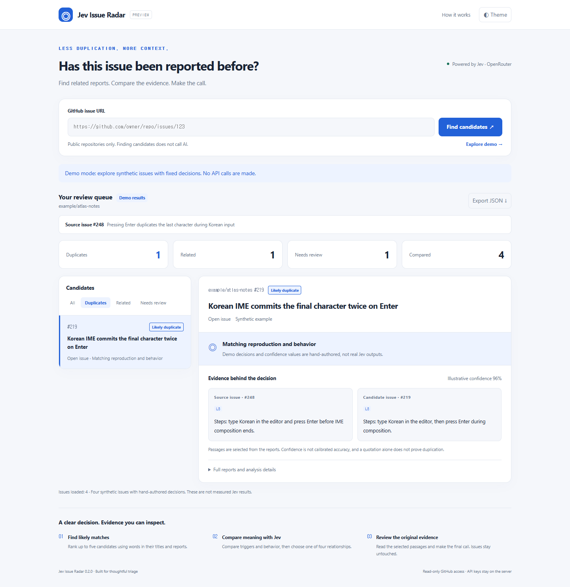

# Jev Issue Radar

**Find duplicate GitHub issues. Show the evidence. Keep maintainers in control.**

A read-only triage dashboard powered by TypeSafe Jev through OpenRouter.

[Quickstart](#quickstart) · [How it works](#how-it-works) · [Validation](docs/VALIDATION.md) · [Contributing](CONTRIBUTING.md)

---

## Why this exists

Two people can report the same bug using completely different words. Two reports can also share an error message while describing different defects.

Issue Radar retrieves a small candidate set, asks Jev to classify each pair, and puts the selected passages side by side. **The model selects a relationship and evidence IDs; the maintainer makes the final call.** It never closes issues, adds labels, or posts comments.

~~~text
Issue URL → retrieve candidates → Jev Choice → inspect original evidence
~~~

**Status: experimental MVP.** The integration works; duplicate-detection quality on real repositories has not been established. In the initial four-pair synthetic smoke test, two relationships matched the author's expected labels. See the full [results and limitations](docs/VALIDATION.md).

## Stack

| Layer | Technology | Why |
|---|---|---|
| Runtime | Node.js 22+, built-in HTTP and fetch | No production dependencies or build step. |
| UI | HTML, CSS, vanilla JavaScript | A small dashboard you can run locally. |
| Retrieval | Title-weighted lexical overlap | Inspect candidates before paying for inference. |
| Decision | Jev 1.13, four Choice questions | Bounded relationship, reason, and evidence selections. |
| Tests | node:test; optional Playwright | Separate application correctness from model quality. |

## How it works

~~~mermaid
flowchart LR
  A[Public GitHub issue] --> B[Up to 300 recently updated items]
  B --> C[Exclude PRs and the source issue]
  C --> D[Rank up to 5 candidates]
  D --> E[Preview original reports]
  E --> F[Jev chooses relation and evidence]
  F --> G[Validate choices and show passages]
~~~

~~~mermaid
flowchart LR
  UI[Local browser] --> S[Loopback Node server]
  S --> GH[GitHub REST: read only]
  S --> OR[OpenRouter Decisions API]
  KEY[Server environment variable] --> S
  S --> UI
~~~

Each candidate is classified as **likely duplicate**, **related**, **distinct**, or **insufficient info**. Two further choices select passages from the original reports; a fourth selects a reason category.

A duplicate is displayed only when both evidence IDs exist, its reason is compatible, the input was not truncated, and model confidence is at least 0.8. This is a conservative product rule, **not a calibrated accuracy guarantee**. A valid quote does not prove that the model interpreted it correctly.

## Example

> Source: pressing Enter during Korean IME composition duplicates the final character.
>
> Candidate: “Korean IME commits the final character twice on Enter.”
>
> Radar shows the selected reproduction and behavior passages from both reports.

The default English demo contains synthetic issues and hand-authored decisions. Its confidence values are illustrative, not measured model outputs. The original Korean/English cases used for the paid integration check are preserved separately in [data/evaluation-fixtures.mjs](data/evaluation-fixtures.mjs).

## Features

| Feature | Behavior |
|---|---|
| Public issue URLs | Validates the host and issue path; rejects pull requests. |
| Free candidate preview | Fetches GitHub reports without invoking Jev. |
| Four relationship labels | Keeps “related” and “insufficient” separate from duplicates. |
| Side-by-side evidence | Shows selected source passages, with stable line IDs. |
| Conservative duplicate display | Downgrades unsupported or inconsistent duplicate judgments. |
| Filters and full reports | Inspect any candidate and its model metadata. |
| JSON export | Export reports, decisions, scan coverage, latency, and reported cost. |
| No-key demo | Explore the workflow without credentials or paid calls. |
| Responsive themes | Light and dark layouts for desktop and mobile. |
| Repeat-request protection | Reuses completed results for the same preview ID for up to 10 minutes. |

## Design decisions

<b>Evidence selection instead of generated explanations</b>

Jev chooses original line IDs. Unknown IDs and malformed choices are rejected. The application copies the corresponding text verbatim instead of asking a model to invent an explanation. Semantic relevance still needs review.

<b>Retrieval scores are not duplicate probabilities</b>

Lexical overlap only selects candidates. A differently worded or cross-language duplicate may never reach Jev. Retrieval recall and pair-classification quality must be evaluated separately.

<b>Raw decisions remain inspectable</b>

Both the raw model relationship and the displayed relationship are retained. Missing evidence, inconsistent reasons, low confidence, or truncated input prevent a strong duplicate label.

<b>Errors remain errors</b>

Timeouts, provider failures, and invalid responses are not silently labeled “distinct.” Successful candidates remain available if another comparison fails. There are no automatic paid retries.

<b>One preview, one analysis</b>

The server assigns a snapshot ID, serializes requests, and reuses completed results for that ID. A session call cap bounds the number of requests; it is not a dollar budget.

<b>Credentials stay on the local server</b>

The UI and exports never receive the API key. The server binds to loopback and checks Host, Origin, and a request token. GitHub is accessed without an authentication token.

## Project structure

~~~text
index.html                    # Dashboard and interactions
server.mjs                    # Local API, snapshots, call limits
lib/core.mjs                  # URL validation, retrieval, evidence rules
lib/github.mjs                # Public GitHub issue reader
lib/jev.mjs                   # Real OpenRouter Jev decision call
data/demo.mjs                 # English UI examples and fixed decisions
data/evaluation-fixtures.mjs   # Original multilingual integration cases
tests/check_all.mjs            # Offline logic and local HTTP tests
scripts/check-syntax.mjs       # Module and inline-script syntax checks
scripts/browser-smoke.mjs      # Optional browser interaction checks
scripts/live-smoke.mjs         # Explicitly approved paid smoke test
docs/                         # Screenshot, measured results, limitations
~~~

## Quickstart

**Node.js 22 or newer. No npm install required.**

~~~bash
git clone https://github.com/Patrick-SCH03/jev-issue-radar.git
cd jev-issue-radar
node server.mjs
~~~

Open **http://127.0.0.1:4318**. The demo and public GitHub candidate preview work without an OpenRouter key.

To enable real comparisons, set OPENROUTER_API_KEY in your environment, then:

~~~bash
# macOS / Linux
JEV_ENABLE_LIVE=1 node server.mjs
~~~

~~~powershell
# Windows: reads the existing process or user environment variable
.\run.ps1 -Live
~~~

| Environment variable | Default | Purpose |
|---|---|---|
| OPENROUTER_API_KEY | Unset | Server-side credential for paid comparisons. |
| JEV_ENABLE_LIVE | Off | Set to 1 to allow paid analysis. |
| JEV_MODEL | typesafe/jev-1.13 | The version used in the recorded integration check. |
| JEV_MAX_CALLS | 20 | Per-process request cap; maximum 100. Not a dollar budget. |
| PORT | 4318 | Loopback server port. |

You can opt into the moving model alias with JEV_MODEL=~typesafe/jev-latest. Results may change. Environment files are not loaded automatically. Use account-level limits in OpenRouter for a dollar spending cap.

Run the checks:

~~~bash
node --test tests/check_all.mjs
node scripts/check-syntax.mjs
~~~

Optional browser checks require Playwright and an installed browser. PLAYWRIGHT_MODULE can point to a local module; PLAYWRIGHT_CHANNEL=msedge uses installed Edge.

## API

| Method | Route | Purpose |
|---|---|---|
| GET | /api/status | Version, enabled capabilities, request token; never the key. |
| GET | /api/demo | Synthetic issues and fixed decisions. |
| POST | /api/preview | Accepts url; reads the source issue and retrieves candidates. |
| POST | /api/analyze | Accepts a preview id; compares at most five pairs. |

POST requests require application/json and the X-Radar-Token returned by /api/status.

The actual provider integration and decision call are in **[lib/jev.mjs](lib/jev.mjs)**. It sends four Choice questions to **POST https://openrouter.ai/api/alpha/decisions**, not Chat Completions. The question schema and response policy are in [lib/core.mjs](lib/core.mjs).

Results include relation, rawRelation, reason, sourceEvidence, candidateEvidence, confidence, latencyMs, costUsd, and model. Failed comparisons have relation=failed and an explicit error.

## Data and limitations

| Area | Current scope | Limitation |
|---|---|---|
| GitHub input | Titles, bodies, issue state | No comments, attachments, image understanding, or full history. |
| Scan | Up to 3 pages × 100 recently updated items | Old duplicates may be missed; PRs count toward fetched items. |
| Retrieval | Up to 5 lexical matches | Cross-language and synonym recall are unmeasured. |
| Jev input | First 12,000 body characters; up to 60 lines, 360 characters each | Truncation is marked and blocks a strong duplicate label. |
| Confidence | Model-returned value | Not calibrated correctness. |
| Demo | Hand-authored English examples | Not a model-quality benchmark. |

### Initial integration measurements

Four original Korean/English synthetic pairs were sent once each to Jev. All calls returned valid structured decisions; **2/4 matched the author's predefined labels**.

| Case | Expected | Returned | Latency |
|---|---|---|---:|
| Same IME reproduction, differently worded | duplicate | duplicate | 460ms |
| IME composition interrupted by autosave | related | distinct | 291ms |
| Search requests duplicated by two handlers | distinct | distinct | 296ms |
| Vague Korean-input complaint | insufficient | related | 317ms |

Total provider-reported cost: **US$0.000294084**. No unknown-cost calls. These are small-sample integration observations, not performance promises or an independent evaluation. The related/distinct boundary itself needs a clearer labeling protocol.

[Raw results](docs/live-smoke-2026-09-20.json) · [Full validation notes](docs/VALIDATION.md)

Useful next contributions are independently labeled real issue pairs, recall@5 evaluation, clearer relationship criteria, and retrieval improvements. Please preserve a held-out set rather than fitting prompts to the demo.

## Notes

- Live comparison sends the selected public issue text to OpenRouter and incurs API charges. The local demo does neither.
- This is an independent project, not an official GitHub, TypeSafe, or OpenRouter product.
- MIT licensed. See [CONTRIBUTING.md](CONTRIBUTING.md) for a small, testable contribution workflow.

References: [GitHub Issues API](https://docs.github.com/en/rest/issues/issues), [TypeSafe Choice patterns](https://docs.typesafe.ai/cookbooks/function_calling), [OpenRouter Jev](https://openrouter.ai/~typesafe/jev-latest).
